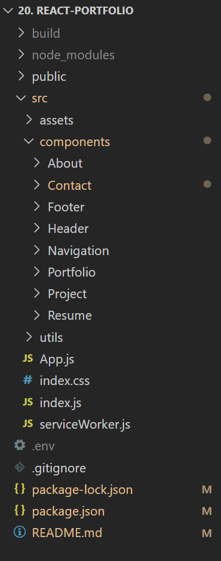

# React Portfolio


  ## Description

  Building my profile using React and framer-motion, as well as utilizing email.js to receive messages sent through My Contact forms from the frontend.

  Acceptance Criteria:

  ```
GIVEN a single-page application portfolio for a web developer
WHEN I load the portfolio
THEN I am presented with a page containing a header, a section for content, and a footer
WHEN I view the header
THEN I am presented with the developer's name and navigation with titles corresponding to different sections of the portfolio
WHEN I view the navigation titles
THEN I am presented with the titles About Me, Portfolio, Contact, and Resume, and the title corresponding to the current section is highlighted
WHEN I click on a navigation title
THEN I am presented with the corresponding section below the navigation without the page reloading and that title is highlighted
WHEN I load the portfolio the first time
THEN the About Me title and section are selected by default
WHEN I am presented with the About Me section
THEN I see a recent photo or avatar of the developer and a short bio about them
WHEN I am presented with the Portfolio section
THEN I see titled images of six of the developer’s applications with links to both the deployed applications and the corresponding GitHub repository
WHEN I am presented with the Contact section
THEN I see a contact form with fields for a name, an email address, and a message
WHEN I move my cursor out of one of the form fields without entering text
THEN I receive a notification that this field is required
WHEN I enter text into the email address field
THEN I receive a notification if I have entered an invalid email address
WHEN I am presented with the Resume section
THEN I see a link to a downloadable resume and a list of the developer’s proficiencies
WHEN I view the footer
THEN I am presented with text or icon links to the developer’s GitHub and LinkedIn profiles, and their profile on a third platform (Stack Overflow, Twitter) 
```

  ## Table of Contents
  - [Description](#description)
  - [Installation](#installation)
  - [Usage](#usage)
  - [Technologies Used](#technologies-used)
  - [License](#license)
  - [Credits](#credits)

  ## Installation
  Run `npm i` 

  File Structure Overview:

  

  ## Usage

  In the project directory, you can run: `npm start`

  Runs the app in the development mode.\
  Open [http://localhost:3000](http://localhost:3000) to view it in the browser.

  The page will reload if you make edits.\
  You will also see any lint errors in the console.

  Running `npm run build` builds the app for production to the `build` folder.\
  It correctly bundles React in production mode and optimizes the build for the best performance.

  The build is minified and the filenames include the hashes.\
  Your app is ready to be deployed!

  Below is a screenshot of the [deployed application](http://jessibewu.github.io/react-portfolio): 

   

  ## Technologies Used

 - @testing-library/jest-dom
 - @testing-library/react
 - @testing-library/user-event
 - emailjs-com
 - framer-motion
 - react
 - react-dom
 - react-router-dom
 - react-scripts
 - web-vitals
 - webpack
  ## License
  This application is covered by [MIT](https://opensource.org/licenses/MIT) license. 
  
  ## Credits: 
  https://courses.bootcampspot.com/
